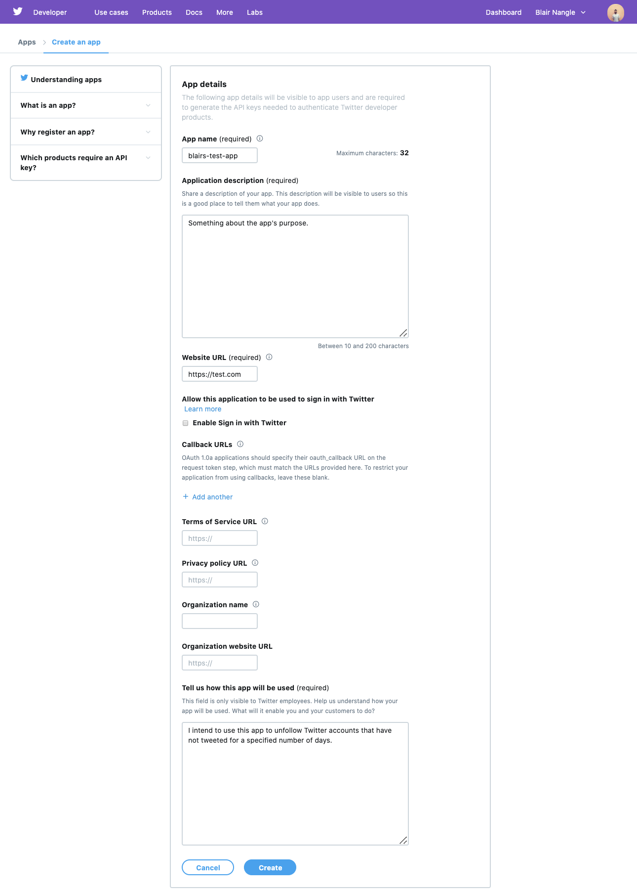

# unfollow-stale

Script to unfollow Twitter accounts that have gone a specified number of days without tweeting.

Makes use of the [Twitter API](https://developer.twitter.com/en/docs/api-reference-index) and 
[Tweepy](https://www.tweepy.org).

## Prerequisites

* [Python 3](https://www.python.org/downloads/)
* [pip](https://pypi.org/project/pip/) (included by default with Python versions >= 3.4)
* [venv](https://docs.python.org/3/library/venv.html) (included by default with Python versions >= 3.3)

## Installation

* Create a virtual environment:

```shell
python3 -m venv venv
```
* Activate the virtual environment:

```shell
source venv/bin/activate
```

* Install requirements:

```shell
pip install -r requirements.txt
```

## Usage

### Obtaining Authentication Tokens

You will need to create a Twitter App to generate authentication keys and tokens. Navigate to 
[Twitter Apps](https://developer.twitter.com/en/apps/create), sign in with your Twitter credentials and create a new 
app:



Accept the terms, go to "Keys and tokens" and generate an access token and secret key.

### Authentication

#### Local

```shell
export CONSUMER_KEY=<insert consumer key>
export CONSUMER_KEY_SECRET=<insert consumer key secret>
export ACCESS_TOKEN=<insert access token>
export ACCESS_TOKEN_SECRET=<insert access token secret>
```

#### GitHub Actions

The environment variables above should be stored as GitHub Actions Secrets.

### Executing

To run the script (the virtual environment needs to have been activated using [above instructions](#installation)
and the credentials need to have been exported as env vars):

```bash
$ ./go.py
```

## License

Distributed under [MIT License](./LICENSE).
